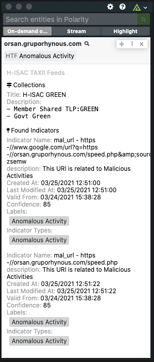
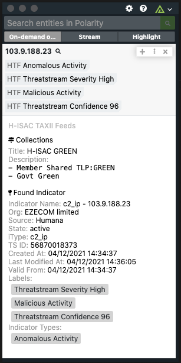

# Polarity H-ISAC TAXII Feeds Integration

The Polarity H-ISAC TAXII Feeds Integration retrieves Collections and Indicator Object data for Domains, URLs, Emails, IPs, and Hashes using H-ISAC's implementation of STIX 2.0 and TAXII 2.0.

To learn more about H-ISAC, please visit the [official website](https://h-isac.org/).

  
  

## H-ISAC TAXII Feeds Integration Options
### H-ISAC TAXII Feed URL
The URL used for your H-ISAC TAXII Feed.

### API Username
The API Username you will use to authenticate.

### API Password
The API Password you will use to authenticate.

### Refresh Data Time
The time for the how often to refresh your data from the TAXII Feed in minutes.

## Installation Instructions

Installation instructions for integrations are provided on the [PolarityIO GitHub Page](https://polarityio.github.io/).

## Polarity

Polarity is a memory-augmentation platform that improves and accelerates analyst decision making.  For more information about the Polarity platform please see:

https://polarity.io/
